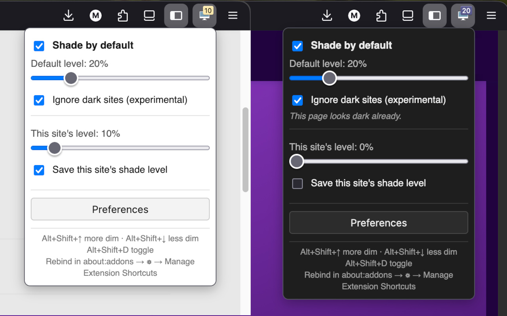

# TabShade

TabShade is a browser extension for Firefox and Chrome that shades the current
browser tab to reduce its brightness, making pages easier on the eyes in dark
environments.

## Features

- **Shade by default** — turn on "Shade by default" in the toolbar popup and
  choose a default level. Every site is then shaded to that level automatically,
  without cluttering your saved-sites list.
- **Save this site's shade level** — for sites you want to treat specially,
  tick "Save this site's shade level" in the popup and set a level with the
  slider. Only saved sites are remembered per domain and shown on the
  preferences page. This keeps the list free of sites you visited only once.
- **Toolbar badge** — the active tab's shade level is shown as a number on the
  TabShade toolbar icon, so you can see it at a glance without opening the popup.
- **Preferences page** — from the extension's preferences (about:addons →
  TabShade → Preferences) you can see every domain you have saved a shade level
  for, adjust each one, rename it, or remove it.
- **Wildcard domains** — a saved entry can use `*` as a wildcard so one entry
  covers many hosts. Edit a domain name on the preferences page to turn it into
  a pattern:
  - `*whatever*` — matches any site whose address contains "whatever"
    (`whatever.dev.corp`, `db-whatever.internal`, …).
  - `*.amazon.com` — matches `amazon.com` and any subdomain (`www.amazon.com`,
    `mail.amazon.com`), but not lookalikes like `notamazon.com`.
  - `mysite.*` — matches `mysite` with any suffix (`mysite.internal`,
    `mysite.example.com`).

  Handy when you flick between many near-identical hosts (e.g. several `mysite`
  or `whatever` database consoles) — one pattern replaces a dozen entries. When
  several entries match a host, an exact hostname wins over any pattern, and the
  most specific pattern (the one with the most literal characters) wins over a
  broader one. Adjusting the slider or using the keyboard shortcuts on a page
  matched by a pattern writes the change back to that pattern, so it stays a
  single entry.
- **Keyboard shortcuts** — adjust the current tab without opening the popup:
  - `Alt+Shift+↑` — more dim (increase the shade level by 5%)
  - `Alt+Shift+↓` — less dim (decrease the shade level by 5%)
  - `Alt+Shift+D` — toggle shading on or off
  - Rebind these at about:addons → ⚙ → **Manage Extension Shortcuts**.

## How it works

- A content script injects a full-page overlay whose opacity corresponds to the
  shade level in effect.
- On page load the level is resolved in this order: a saved level for the
  domain (matched exactly, or via a wildcard pattern) takes precedence,
  otherwise the global default (when "Shade by default" is on), otherwise no
  shading.
- Settings and saved sites are stored with the WebExtensions `storage.local`
  API, so your choices persist across sessions. Only sites you explicitly save
  are remembered per domain.
- A background script keeps the toolbar badge in sync with the active tab and
  handles the keyboard shortcuts.

## Installing for development

### Firefox

1. Open `about:debugging` in Firefox.
2. Choose **This Firefox**.
3. Click **Load Temporary Add-on** and select the `manifest.json` file in this
   repository.

### Chrome

Chrome needs the Chrome build (see below) because it uses a service-worker
background and the `webextension-polyfill`. Once built:

1. Run `npm run build:chrome` to generate `dist/chrome/`.
2. Open `chrome://extensions` in Chrome.
3. Enable **Developer mode** (top-right toggle).
4. Click **Load unpacked** and select the `dist/chrome/` directory.

To rebind the keyboard shortcuts in Chrome, go to
`chrome://extensions/shortcuts`.

## Building

The extension is written against Firefox's native, promise-based `browser` API.
Two builds are produced from the same source tree:

| Command                | Output                                             | Notes                                                            |
| ---------------------- | -------------------------------------------------- | ---------------------------------------------------------------- |
| `npm run build`        | `web-ext-artifacts/tabshade-<version>.zip`         | Alias for `build:firefox`.                                       |
| `npm run build:firefox`| `web-ext-artifacts/tabshade-<version>.zip`         | Firefox package. Uses the native `browser` API; no polyfill.     |
| `npm run build:chrome` | `web-ext-artifacts/tabshade-chrome-<version>.zip`  | Chrome package. Adds the polyfill and a service-worker manifest. |

### How the Chrome build differs

`scripts/build-chrome.mjs` assembles a Chrome package into `dist/chrome/`
without modifying the shared source. It:

- swaps in `manifest.chrome.json` (a service-worker background, with the
  Firefox-only `browser_specific_settings` and `theme_icons` keys removed);
- copies in [`webextension-polyfill`](https://github.com/mozilla/webextension-polyfill)
  so the `browser.*` calls work on top of Chrome's `chrome.*` APIs;
- loads the polyfill before every script — in the content script (via the
  manifest), the popup and options pages (via an injected `<script>` tag), and
  the service worker (via `importScripts`);
- rewrites the popup's shortcut hint to point at `chrome://extensions/shortcuts`
  instead of `about:addons`.

The build fails loudly if the strings it patches (the page `<script>` tags and
the shortcut hint) are ever renamed, so keep those in mind when editing
`popup/popup.html` and `options/options.html`.

The `manifest.json` in the repository root is the Firefox manifest; the Chrome
manifest lives in `manifest.chrome.json`.

## Icons

The icons used in this extension are from **IconBeast Lite**, available at
[IconBeast](https://www.iconbeast.com/free/).

This icon set came from IconBeast (https://www.iconbeast.com/). Per the
IconBeast Lite license, redistribution is permitted provided the source is
acknowledged and a link back to IconBeast is included, which this project does
here.

## Built with Kiro

This extension was built with the help of [Kiro](https://kiro.dev), an
AI-powered development environment.

## License

This project is licensed under the GNU General Public License v3.0. See the
[LICENSE](LICENSE) file for details.
